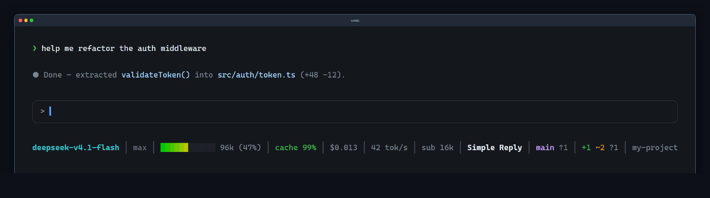

# cmdc-statusline

[English](README.md) | [简体中文](README.zh-CN.md) | [繁體中文](README.zh-TW.md) | [日本語](README.ja.md) | [한국어](README.ko.md) | **Español** | [Français](README.fr.md) | [Deutsch](README.de.md) | [Русский](README.ru.md)

Una barra de estado para [Command Code](https://commandcode.ai) (`cmd`, o `cmdc` en Windows):
modelo, barra de contexto con degradado, tasa de aciertos de caché, coste de la sesión,
velocidad de salida, uso de subagentes, nombre de sesión y estado de git, dibujada bajo el
panel de entrada con `cmd.ui.setStatus()`.



**Requiere Command Code ≥ 1.10.0.**

## Instalación

```bash
cmd mods add cmdc-statusline -g
cmd mods list
```

Alternativas:

- **Desde git:** `cmd mods add holtwood/cmdc-statusline -g`
- **Un solo archivo:** copia `index.ts` a `~/.commandcode/mods/statusline.ts`
  (`%USERPROFILE%\.commandcode\mods\statusline.ts` en Windows) — sin compilación
- **Probar sin instalar:** `cmd --mod ./index.ts` (los mods se cargan una vez por proceso —
  usa `/reload` para aplicar cambios)

En Windows el binario es `cmdc` (`cmd` es el shell de Windows). Elige una sola vía — el
paquete y el archivo suelto son dos mods que declaran los mismos flags, y los nombres de
flag se resuelven globalmente entre mods.

### Instalarlo con tu agente

Pega esto en tu agente:

> Instala el mod `cmdc-statusline` de Command Code en ámbito de usuario: ejecuta
> `cmd mods add cmdc-statusline -g` (usa `cmdc` en Windows; si npm no lo encuentra, usa
> `holtwood/cmdc-statusline`), confirma que `cmd mods list` lo muestra y luego dime que
> reinicie la sesión.

## Segmentos

| Segmento | Significado |
|---|---|
| `deepseek-v4.1-flash` | Modelo activo (`raw-model=true` conserva el prefijo del proveedor) |
| `max` | Esfuerzo de razonamiento de la última petición |
| `█░░░ 32k (3.2%)` | Contexto de la última petición: barra con degradado (verde→rojo), tokens, porcentaje de la ventana |
| `cache 99%` | Tasa de aciertos de la caché de prompt |
| `$0.013` | Coste de la sesión: historial al reanudar + peticiones nuevas |
| `42 tok/s` | Velocidad de salida de la última petición (tiempo real, incluye la espera del primer token) |
| `sub 16k` | Tokens consumidos por subagentes en esta sesión |
| `Simple Reply` | Nombre de la sesión (sobrevive a `/reload` y a reanudar) |
| `main ↑1` | Rama de git con ahead/behind |
| `+1 ~2 ?1` | preparado · modificado · sin seguimiento (`clean` si está limpio) |
| `my-project` | Nombre del directorio actual |

## Configuración

```
~/.commandcode/statusline.json          ámbito de usuario
<proyecto>/.commandcode/statusline.json ámbito de proyecto (prevalece sobre el de usuario)
--mod-option <clave>=<valor>            ajuste por ejecución
```

```json
{"preset": "full", "bar-width": 12, "refresh": 10, "cache": true, "cost": true}
```

Presets: `full` (por defecto, todo) · `minimal` (model, effort, context, bar, percent, git)
· `usage` (context, bar, percent, cache, cost, sub). Una clave escrita junto a un preset lo
prevalece.

| Clave | Por defecto | Notas |
|---|---|---|
| `model`, `effort`, `context` | `true` | modelo / esfuerzo / contexto de la última petición |
| `bar`, `bar-width`, `percent` | `true`, `12`, `true` | barra, ancho en celdas, porcentaje |
| `cache`, `cost`, `speed`, `sub` | `true` | aciertos / coste de sesión / velocidad / tokens de subagentes |
| `name`, `git`, `cwd` | `true` | nombre de sesión (24 caracteres máx.) / rama + cambios / directorio |
| `preset` | `full` | `full` / `minimal` / `usage` |
| `raw-model`, `ascii` | `false` | conservar prefijo del proveedor / render ASCII plano |
| `refresh` | `10` | segundos entre lecturas de git (`0` desactiva el sondeo) |

Dos comandos lo consultan y lo cambian sin tocar el JSON:

- `/statusline` — la línea renderizada, los valores en bruto, una tabla
  `clave / defecto / efectivo / origen` y un aviso por cada entrada inutilizable (claves
  desconocidas, tipos erróneos, presets inválidos). El texto del informe está en chino.
- `/statusline config` — editor interactivo (elige ámbito → clave → valor → confirma);
  escribe una sola clave y repinta al instante, sin `/reload`.

Ojo: `--mod-option` solo cuenta como ajuste explícito cuando el valor difiere del
predeterminado — pasar `cwd=true` no gana a un archivo de configuración que dice `false`.

## Cómo funciona

- **Arranque/reanudación:** antes de la primera petición, el modelo y el esfuerzo salen de
  `~/.commandcode/config.json`; una sesión reanudada también restaura contexto, aciertos de
  caché y coste desde el transcript. La velocidad y los tokens de subagentes necesitan una
  petición real.
- **Colores:** `COLORTERM=truecolor|24bit` → degradado de 24 bits, si no aproximación de
  256 colores; `ascii=true` o `TERM=dumb` → `#`/`-`; `NO_COLOR` conserva los bloques y
  quita el color.
- **Terminales estrechas:** se descartan segmentos por prioridad en vez de recortar
  (cwd → velocidad → esfuerzo → subagentes → caché → nombre → coste → cambios → la barra
  encoge → rama); el modelo nunca se descarta. Redibuja al cambiar el tamaño.
- **Orígenes:** modelo/esfuerzo/contexto/caché desde los eventos de petición; coste =
  transcript al reanudar + cada petición tarifada con una tabla generada; tokens de
  subagentes desde `subagent_stop`; git con `git status --porcelain=v1 -b` (mínimo de 5 s +
  sondeo cada `refresh`).
- **Tablas de modelos:** las ventanas de contexto y los precios se **generan** del catálogo
  de modelos incluido en el CLI — `python3 scripts/gen-model-tables.py` para regenerar,
  `--check` para detectar deriva (lo corre CI). Un modelo ausente degrada con gracia
  (sin barra / sin coste).

## Contribuciones

Issues y pull requests son bienvenidos.

## Licencia

MIT
